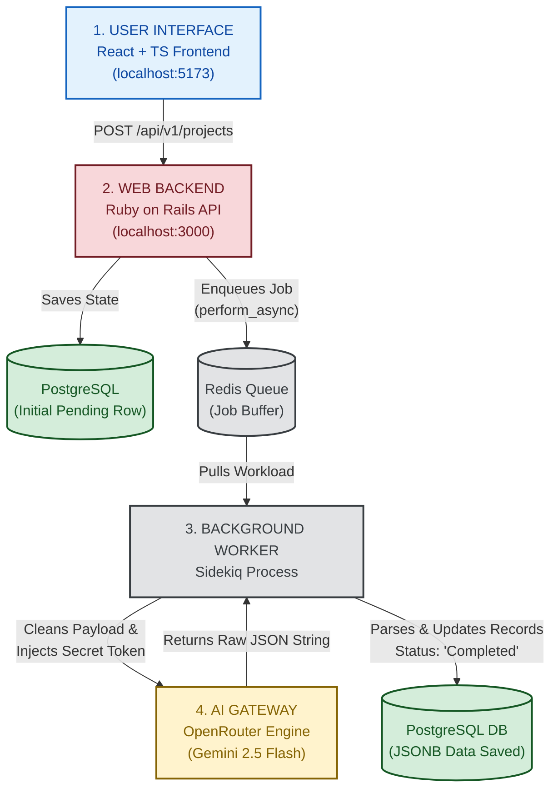

# PromptOps: AI-Assisted Full-Stack Code Reviewer

An automated code review hub that performs asynchronous code architecture audits using modern LLMs. Built to demonstrate senior-level software architecture, clean separation of concerns, relational database schema integrity, and background task orchestration.

## Tech Stack & Core Architecture

The platform is split into decoupled layers optimized for performance, scalability, and asynchronous execution:

- **Frontend SPA**: Single Page Application built with **React**, **TypeScript**, and **Vite** utilizing strict type safety (catching unknown error boundaries and leveraging explicit Axios type guards over unsafe "any" captures) and crisp UI feedback.
- **Backend API**: Pure REST API built with **Ruby on Rails 8** exposing secure, resource-based endpoints.
- **AI Integration Engine**: Isolated Ruby Service Objects utilizing **Faraday** to pipeline contextual code vectors directly to **Google's Gemini 2.5 Flash** via OpenRouter, utilizing defensive payload formatting and hard token caps (`max_tokens: 1000`).
- **Relational Database**: **PostgreSQL** managing structural data integrity across three relational tables with unique indexing and native `JSONB` data formats for fast feedback processing.
- **Task Queue & Message Broker**: **Redis** handling high-throughput asynchronous job states out-of-band.
- **Background Worker**: **Sidekiq** processing non-blocking, multi-threaded LLM execution threads to protect the web server's core event loops.

## System Architecture Flow




## Quick Start (Local Development)

### Prerequisites
- Docker Desktop running
- Node.js (v24+)
- Ruby (v3.3+)

### 1. Database & Infrastructure Provisioning
Spin up your containerized PostgreSQL and Redis engines instantly via Docker Compose from your root directory:
```bash
docker compose up -d
```
*Note: Databases automatically bind to standard internal network ports (`5432` for Postgres, `6379` for Redis).*

### 2. Secure Environment Variables
Create a hidden environment file inside your backend directory to house your authenticated API string:
```bash
# Inside promptops-backend/ create a .env file:
OPENROUTER_API_KEY="sk-or-v1-YOUR_ACTUAL_TOKEN_STRING"
```

### 3. Backend & Queue Initialization
Navigate to the backend directory, run package bundlers, migrate relational schemas, and kick off the dual processes:
```bash
cd promptops-backend
bundle install
bundle exec rails db:create db:migrate
bundle exec rails server

# In a separate terminal shell within promptops-backend/:
bundle exec sidekiq
```

### 4. Frontend Compilation
Navigate to the frontend directory, orchestrate package allocations, and boot the static rendering engine:
```bash
cd ../promptops-frontend
npm install
npm run dev
```
Open your local loopback address at `http://localhost:5173/` to interact with the system.

## Testing & Enterprise CI/CD Pipeline
Continuous Integration is fully automated using GitHub Actions (`.github/workflows/ci.yml`). Every single push or pull request to the `master`/`main` branches boots a multi-layered matrix running on a headless **Node 24** and **Ruby 3.3** Ubuntu kernel:

- **Static Analysis (Brakeman)**: Scans the codebase automatically for common Rails vulnerabilities.
- **Style Consistency (RuboCop)**: Enforces community style guides and automated syntax validation.
- **Type Security**: Frontend compilation checks verify strict ESLint rules, preventing any execution leakage.
- **Isolated Integration Testing**: Automatically instances background Postgres and Redis services inside the GitHub Actions cloud engine to compile database tables and evaluate schema loaders natively.